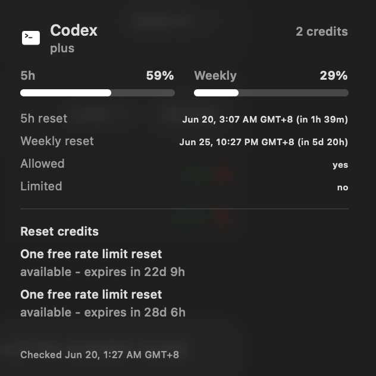

# Traice

## About

Traice is a native macOS menu bar app and Notification Center widget for Codex 5-hour and weekly usage, Cursor usage, reset times, and reset credits.

This project is unofficial and is not affiliated with OpenAI. It reads your local Codex auth file and calls private ChatGPT/Codex usage endpoints that may change without notice.

## Preview

Widget
<p>
  
</p>

Menu bar
<p>
  
</p>

## Features

- Track Codex 5-hour and weekly usage from the macOS menu bar and Notification Center widget.
- Track Cursor usage from the menu bar and widget when Cursor auth is available locally.
- See when the 5-hour and weekly usage windows reset, including relative times in the widget and exact timestamps in the menu bar dropdown.
- View available Codex reset credits and when each credit expires.
- Refresh menu bar usage about every 30 seconds and share fresh snapshots with the widget when macOS allows it to reload.

## Requirements to Run

- macOS 14 or newer.
- Codex Desktop signed in on the same Mac.
- A readable Codex auth file at `~/.codex/auth.json`.
- Cursor signed in on the same Mac for Cursor usage.
- Network access to the ChatGPT/Codex and Cursor usage endpoints.

## Install

From the project root:

```sh
./install-native.sh
```

The default install creates:

```text
~/Applications/Traice.app
~/Applications/Traice.app/Contents/PlugIns/Traice Widget.appex
~/Library/LaunchAgents/com.juicecolored.traice.plist
```

To install somewhere else:

```sh
./install-native.sh "/path/to/Traice.app"
```

To add the widget, open Notification Center, choose **Edit Widgets**, search for **Traice**, and add the small, medium, or large widget. Traice asks WidgetKit to reload after fresh menu bar usage checks, but macOS still controls the final widget refresh cadence.

To uninstall:

```sh
./uninstall-native.sh
```

## Development Requirements

- Xcode with macOS and WidgetKit support.
- Xcode command line tools.
- No external package manager dependencies.

Optional runtime environment variables:

```sh
CODEX_AUTH_PATH=~/.codex/auth.json
CURSOR_AUTH_DB_PATH=~/Library/Application Support/Cursor/User/globalStorage/state.vscdb
CURSOR_USAGE_ENABLED=1
CODEX_USAGE_TIMEZONE=UTC
CODEX_USAGE_TIMEOUT=60
CURSOR_USAGE_TIMEOUT=60
```

If `CODEX_USAGE_TIMEZONE` is omitted, Traice uses the Mac's current system timezone. The widget sandbox is limited to the default `~/.codex/auth.json` path; use `CODEX_AUTH_PATH` for the menu bar app only unless you also update the widget entitlement and rebuild.

Cursor usage is fetched by the menu bar app from Cursor's local auth database and cached into Traice's shared usage snapshot. The widget reads that sanitized Traice snapshot instead of reading Cursor's database directly.

Optional installer overrides:

```sh
TRAICE_APP_BUNDLE_ID=com.juicecolored.traice \
TRAICE_WIDGET_BUNDLE_ID=com.juicecolored.traice.widget \
TRAICE_LAUNCH_AGENT_LABEL=com.juicecolored.traice \
TRAICE_DERIVED_DATA=/tmp/traice-derived-data \
./install-native.sh
```

Use the same bundle IDs and launch agent label when uninstalling a custom install.

## Development Setup

Build:

```sh
xcodebuild \
  -project Traice.xcodeproj \
  -scheme "Traice" \
  -configuration Debug \
  -destination "generic/platform=macOS" \
  build
```

Test:

```sh
xcodebuild \
  -project Traice.xcodeproj \
  -scheme "Traice" \
  -destination "platform=macOS" \
  -derivedDataPath /tmp/traice-test-derived-data \
  test
```

Use a separate `-derivedDataPath` when running build and test commands concurrently.

## Privacy

Traice reads the local Codex auth file and Cursor auth database only to make authenticated usage requests. It does not persist, transmit, or log your access tokens outside those requests.

The widget extension is sandboxed with read-only access to `~/.codex/auth.json`, Traice's cached usage snapshot, and outbound network access. Cursor usage shown in the widget comes from the cached Traice snapshot written by the menu bar app.
